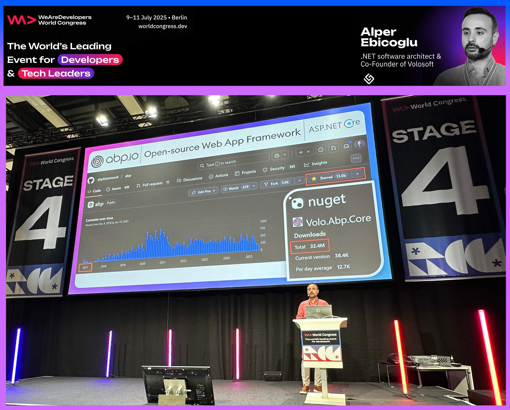
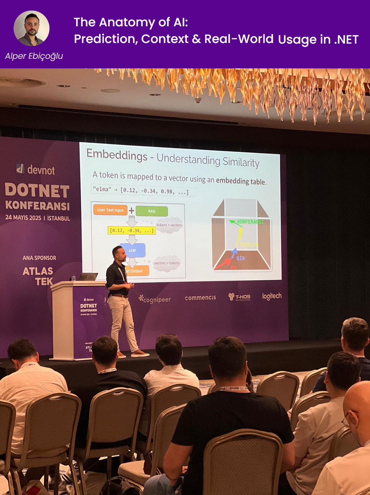
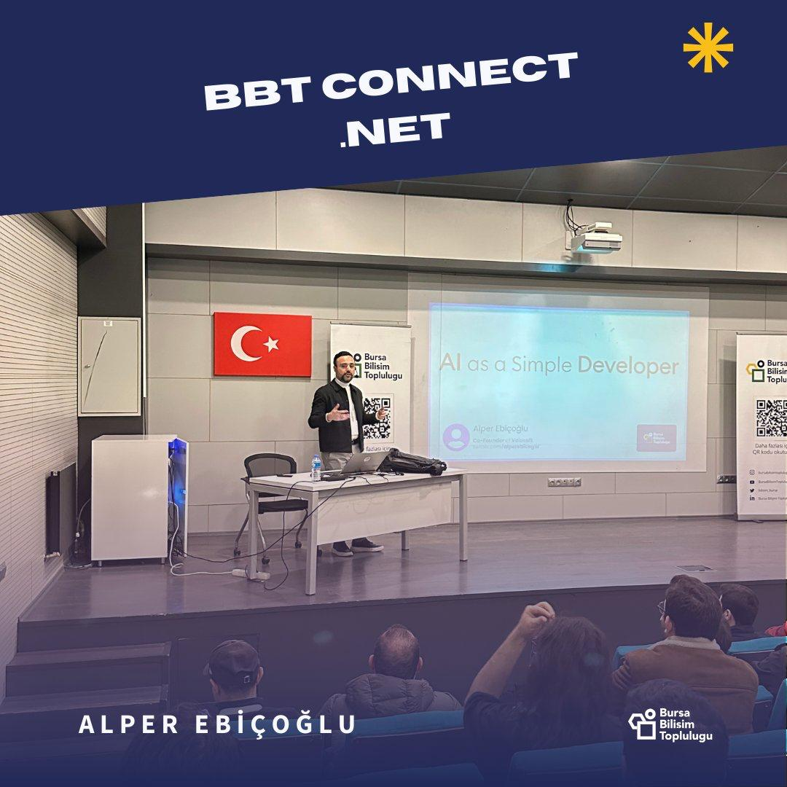
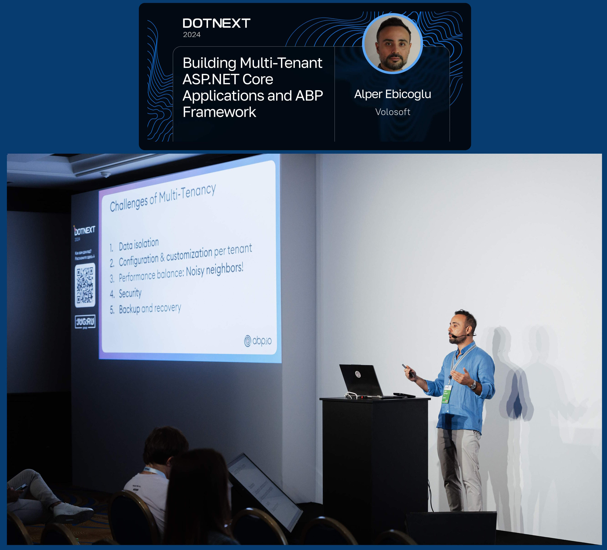
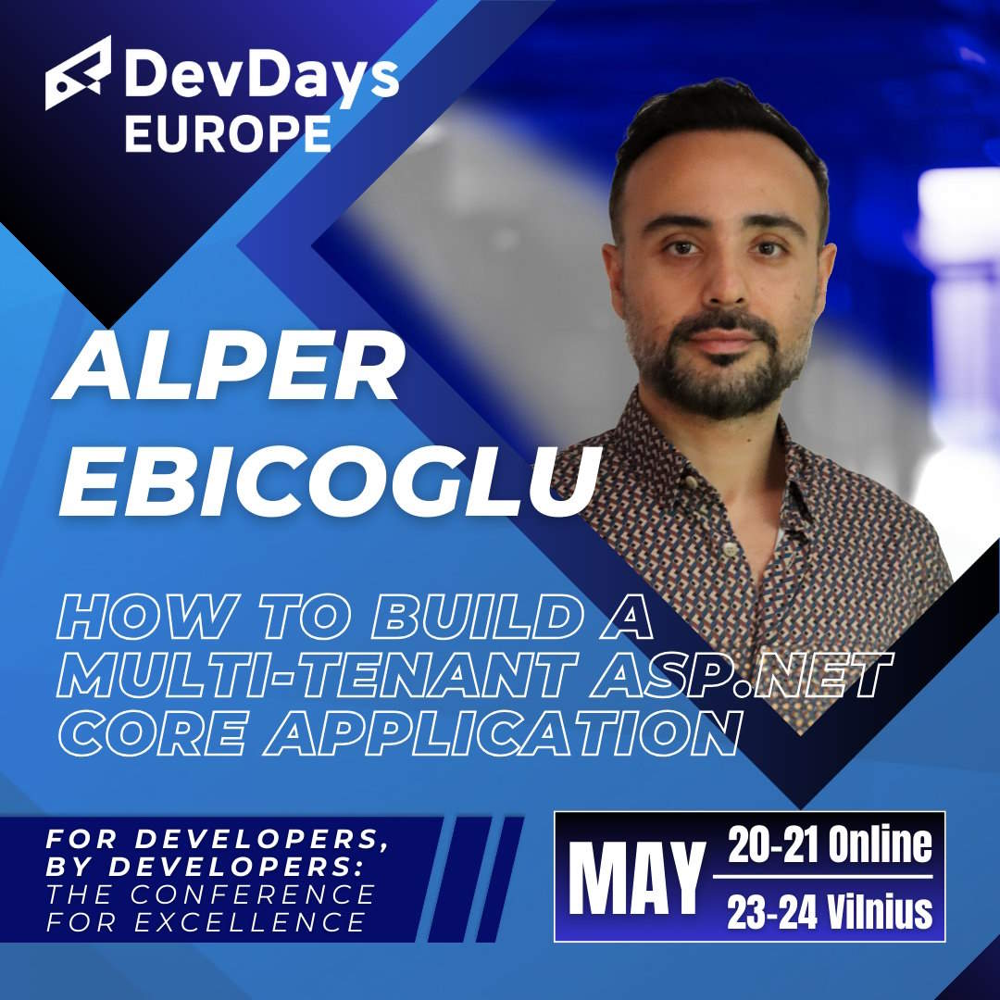
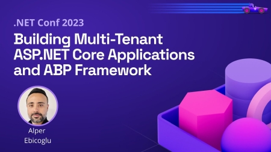
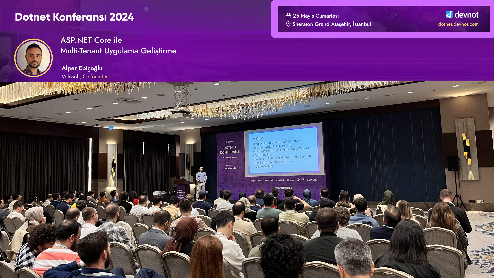
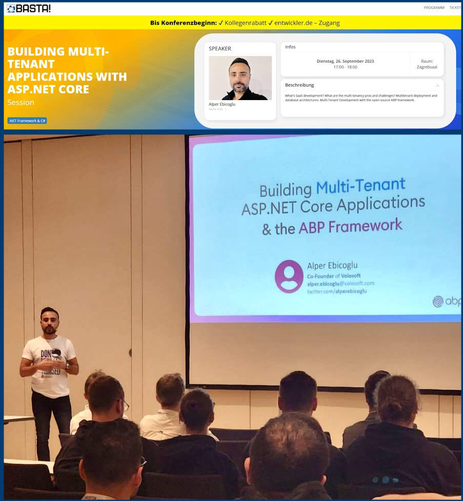
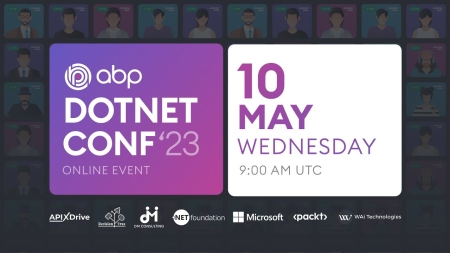

# My Talks & Presentations at Conferences

Here's my talks at various developer conferences:

## Convex 2026

📕 **Title:** Chat with Your Data: Turn any database into a conversational reporting 
📍 **Location:** Marid / Spain  
📅 **Date:** June 18, 2026  
🔗 **Website:** [convexsummit.com](https://www.convexsummit.com/) 

---

## DevDays 2026
📕 **Title:** From Natural Language to SQL: Building an AI-Powered Query Generator with .NET 
📍 **Location:** Vilnius / Lithuania  
📅 **Date:** May 21, 2026  
🔗 **Website:** [devdays.lt](https://events.pinetool.ai/3574/#sessions/112182) 

---

## Devnot .NET Conf 2026
📕 **Title:** From Natural Language to SQL 
📍 **Location:** Istanbul / Turkey  
📅 **Date:** May 07, 2026  
🔗 **Website:** [dotnet.devnot.com](https://dotnet.devnot.com/) 

---

## WeAreDevelopers World Congress 2025
📕 **Title:** Building Multi-Tenant ASP.NET Core Applications: Best Practices and Real-World Solutions 
📍 **Location:** Berlin / Germany  
📅 **Date:** July 11, 2025  
🔗 **Website:** [wearedevelopers.com/world-congress](https://www.wearedevelopers.com/world-congress) 
📁 **Presentation File:** [Presentation.pptx](multi-tenancy-wearedevelopers-2025_30mins.pptx) 
🔗 **Talk**: https://www.youtube.com/watch?v=64CJpMdcWgA

---

## DevNot .NET Conference 2025
📕 **Title:** Anatomy Of AI 
📍 **Location:** Sheraton Grand İstanbul / Turkey  
📅 **Date:** May 24, 2025  
🔗 **Website:** [dotnet.devnot.com](https://dotnet.devnot.com) 
📁 **Presentation File:** [Presentation.pptx](https://github.com/ebicoglu/devnot_dotnet_25_konf/blob/main/anatomy-of-ai.pptx) 

---

## BBT Connect .NET 2025
📕 **Title:** How to Start AI As a Simple Developer 
📍 **Location:** Bursa / Turkey  
📅 **Date:** February 02, 2025  
🔗 **Website:** [bursa.dev](https://bursa.dev) 
📁 **Presentation File:** [Presentation.pptx](ai-as-a-simple-developer-bursa-2025-02-08.pptx) 

 

---

## DotNext 2024
📕 **Title:** Building Multi-Tenant ASP.NET Core Applications and ABP Framework 
📍 **Location:** Moscow Monarch Hotel / Russia  
📅 **Date:** September 11, 2024 
🔗 **Website:** [dotnext.ru](https://dotnext.ru/en/talks/92e02d7837e941578bfc3f39e5303b29/) 
📁 **Presentation File:** [Presentation.pptx](multi-tenancy-with-abp-dotnext-2024.pptx) 

---

## DevDays Europe 2024
📕 **Title:** How to Build a Multi-Tenant ASP.NET Core App 
📍 **Location:**  Vilnius / Lithuania 
📅 **Date:** May 20, 2024 
🔗 **Website:** https://events.pinetool.ai/3152/#sessions/105097 
🔗 **Intro**: https://www.youtube.com/watch?v=WXE1_73Itnw 
🔗 **Talk**: https://www.youtube.com/watch?v=skIYOdj5yGk 
📁 **Presentation File:** [Presentation.pptx](multi-tenancy-with-abp-devdays-2024.pptx) 

---

## Microsoft .NET Conf 2023
📕 **Title:** Building Multi-Tenant ASP.NET Core Applications and ABP Framework  
📍 **Location:** [Microsoft Website Online](https://www.dotnetconf.net/) 
📅 **Date:** November 16, 2023 
🔗 **Website:** https://www.youtube.com/watch?v=3uWeyEbV4c4 
📁 **Presentation File:** [Presentation.pptx](multi-tenancy-dotnet-conf-2023__25mins.pptx) 

---

## DevNot Dotnet Conference 2024
📕 **Title:** How to Build a Multi-Tenant ASP.NET Core Application 
📍 **Location:** Istanbul Ataşehir Sheraton Hotel  / Turkey 
📅 **Date:** May 25, 2024  
🔗 **Website:** [dotnet.devnot.com/2024/](https://dotnet.devnot.com/2024/) 
📁 **Presentation File:** [Presentation.pptx](multi-tenancy-with-abp-devnot-2024_35mins.pptx) 

---

## Basta Conference  2023
📕 **Title:** Building Multi-Tenant Applications with ASP.NET Core 
📍 **Location:** Mainz / Germany 
📅 **Date:** September 26, 2023 
🔗 **Website:** [basta.net](https://basta.net/net-framework-c/multi-tenant-applications-aspnet-core) 
📁 **Presentation File:** [Presentation.pptx](multi-tenancy-with-abp-basta-conf.pptx)

---

## ABP .NET Conference 2023
📕 **Title:** ABP Framework; How it started, How it’s going… 
📍 **Location:** Istanbul ([Online](https://abp.io/conference/2023)) 
📅 **Date:** May 10, 2023 
🔗 **Website:** https://www.youtube.com/watch?v=hB0bY2qEVpA 
📁 **Presentation File:** [Presentation.pptx](abp-conf-2023-keynote.pptx) 

---

### Profile pictures for use in conference calls:

* 
* 

